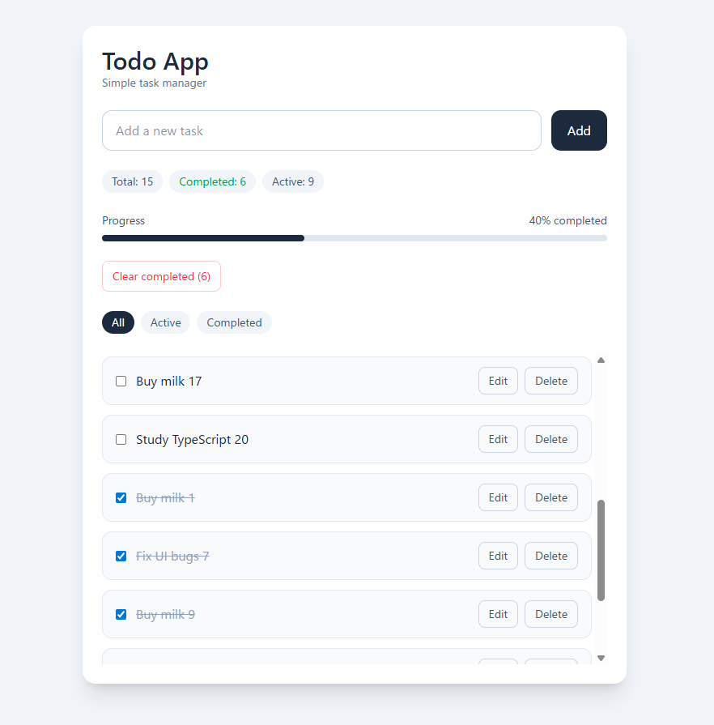

# Todo App

## Overview

A simple Todo management application.

Users can create, edit, and complete tasks through a clean UI.

Built with React, TypeScript, and json-server to implement basic CRUD operations.

## Screenshot



---

## Demo

Live demo: coming soon.

Local development:

```
http://localhost:5173
```

---

## Features

- Add tasks
- Delete tasks
- Toggle task completion
- Edit tasks
- Filter tasks (All / Active / Completed)
- Clear completed tasks
- Progress bar
- Scrollable todo list
- Loading / error states

## Tech Stack

- React
- TypeScript
- Vite
- Tailwind CSS
- json-server
- ESLint

## Setup

### 1. Clone repository

```bash
git clone https://github.com/mae134/todo-app.git
cd todo-app
```

### 2. Install dependencies

```bash
npm install
```

### 3. Create local database

```bash
cp db.example.json ../todo-local-db/db.json
```

### 4. Start API server

```bash
npm run api
```

json-server runs at the following endpoint:

```
http://localhost:3001/todos
```

### 5. Start frontend

```bash
npm run dev
```

```
http://localhost:5173
```

## Database Utilities

### Generate database

```bash
node scripts/seedDb.mjs
```

### Reset database

```bash
node scripts/resetDb.mjs
```

## Project Structure

```
todo-app
├ docs
│ └ screenshot.png
├ src
│ ├ components
│ │ └ TodoItem.tsx
│ ├ hooks
│ │ └ useTodos.ts
│ ├ api
│ └ App.tsx
│
├ scripts
│ ├ seedDb.mjs
│ └ resetDb.mjs
│
├ db.example.json
├ package.json
└ README.md
```

## API

This project uses json-server as a mock API.

### GET /todos

Fetch all todos.

### POST /todos

Create a new todo.

### PATCH /todos/:id

Update a todo.

### DELETE /todos/:id

Delete a todo.

## Architecture

- React functional components
- Custom hook (`useTodos`) for API logic
- json-server used as a mock backend
