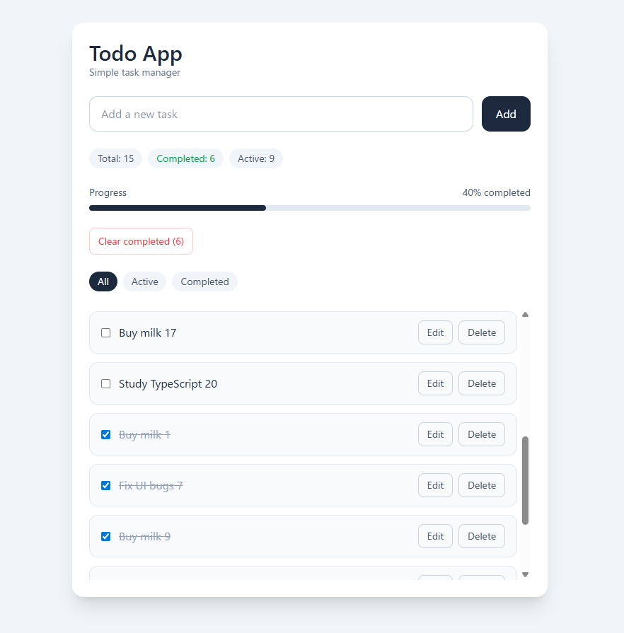

# Todo App

## Overview

A simple Todo management application with authentication and secure data isolation.

Users can create, edit, and complete tasks through a clean UI.

Built with React, TypeScript, and Supabase.

The app supports user authentication and secure data access using Row Level Security (RLS).

## Screenshot



---

## Demo

Live demo:
https://todo-app-kohl-mu-20.vercel.app/

---

## Features

- Add tasks
- Delete tasks
- Toggle task completion
- Edit tasks
- Filter tasks (All / Active / Completed)
- Clear completed tasks
- Progress bar
- Scrollable todo list
- Loading / error states
- User authentication (Sign up / Login / Logout)
- Per-user todo isolation with Row Level Security (RLS)

## Tech Stack

| Technology   | Purpose                 |
| ------------ | ----------------------- |
| React        | UI                      |
| TypeScript   | Type safety             |
| Vite         | Development environment |
| Tailwind CSS | Styling                 |
| ESLint       | Linting                 |
| Supabase     | Database / Auth / API   |

## Setup

### 1. Clone repository

```bash
git clone https://github.com/mae134/todo-app.git
cd todo-app
```

### 2. Install dependencies

```bash
npm install
```

### 3. Run development server

The application uses Supabase as a backend service.
No local API server is required.

```bash
npm run dev
```

Then open the URL shown in the terminal (usually `http://localhost:5173`).

## Environment Variables

This project requires Supabase environment variables.

Create a `.env.local` file in the project root and add the following:

```env
VITE_SUPABASE_URL=your_supabase_project_url
VITE_SUPABASE_ANON_KEY=your_supabase_anon_key
```

You can copy the example file:

```bash
cp .env.example .env.local
```

Then fill in the values.

## Project Structure

- `src/components`  
  UI components

- `src/hooks`  
  Custom hooks for API and state management

- `src/api`  
  API abstraction for todo operations

- `docs`  
  Project screenshots

```
todo-app
├ docs
│ └ screenshot.png
├ src
│ ├ components
│ │ └ TodoItem.tsx
│ ├ hooks
│ │ └ useTodos.ts
│ ├ api
│ └ App.tsx
├ package.json
└ README.md
```

## Architecture

- React functional components
- Custom hook (useTodos) for API logic
- Supabase client for backend communication
- Separation of UI and business logic
- Authentication and authorization handled via Supabase Auth and RLS

## Data Model

- todos
  - id
  - text
  - done
  - user_id
  - created_at

## API

This project uses Supabase as a backend service.

All CRUD operations are performed via the Supabase client SDK.

The client communicates directly with the Supabase REST API.

- Data is stored in the `todos` table
- Each todo is associated with a user via `user_id`
- Access is controlled using Row Level Security (RLS)

## Security

- Authentication is handled by Supabase Auth
- Each user can only access their own data
- Row Level Security (RLS) is enforced at the database level

Example policy:

```sql
using (auth.uid() = user_id)
```

## Deployment

This application is deployed on Vercel.

- Frontend: Vercel
- Backend: Supabase

## Environment

Currently, the same Supabase project is used for both development and production for simplicity.

In a real-world application, separate environments (development / production) should be used.

## Troubleshooting

- If login fails, check environment variables
- Ensure Supabase project is active

## Notes

- The application uses Supabase as a backend service
- No local API server is required
- Make sure environment variables are correctly set before running the app

## License

This project is for learning and portfolio purposes.
